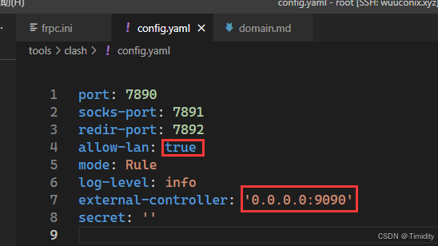
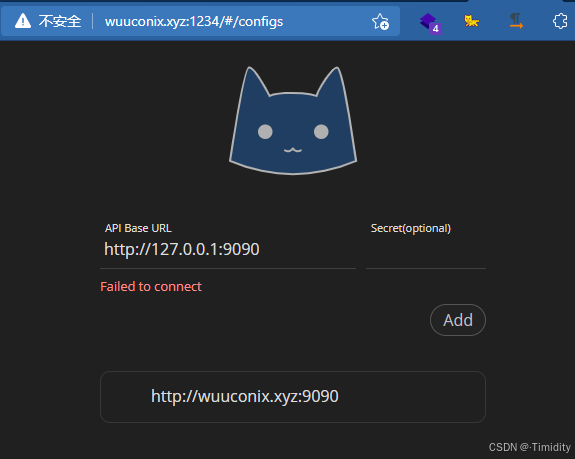
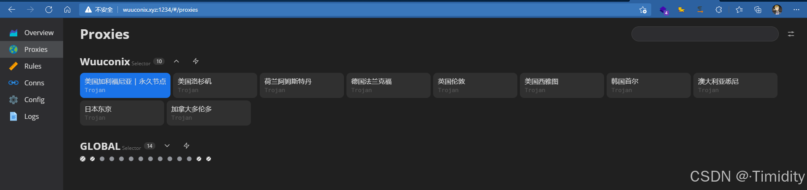

---
category:
  - 教程
tag:
  - VPN
  - 技巧

---

# Docker 版的Clash Linux使用

## 镜像

作者的GitHub仓库删了,但是DockerHub的镜像没删
```bash
docker pull dreamacro/clash
docker pull haishanh/yacd
```

## 下载config.yaml

```bash
wget xxxx ## 要么拉下来 要么自己拷贝上来
# 注意： 名称为：config.yaml
```

### **这里要特别注意，我们的config.yaml里有两个项特别重要的配置。**


```bash
# external-controller :需要设置为0.0.0.0，保证dashboard容器能够访问到
# allow-lan :必须设置为true,允许局域网访问
```

## 运行容器

```bash
docker run -d --name=clash -v "$PWD/config.yaml:/root/.config/clash/config.yaml" -p "7890:7890" -p "9090:9090" --restart=unless-stopped dreamacro/clash
docker run -p 1234:80 -d --name clash-dashboard haishanh/yacd
```
确保config.yaml没错并且运行完以上四个命令后，就可以进dashboard了，url就是的主机ip:1234

默认的http://127.0.0.1:9090是不可能成功进去的，因为这个127.0.0.1代表的是dashboard的本地，而真正的clash服务是在令一个容器内，所以我们真正的地址应该是主机ip:9090。


## 使用
配置命令别名

`vim ~/.bashrc` 将下面命令写入该文件 (建议为root用户)

```bash

# 设置/取消代理
alias proxy_on="export https_proxy=127.0.0.1:7890 && export http_proxy=127.0.0.1:7890"
alias proxy_off="unset http_proxy https_proxy"
# 启动/关闭clash 并设置代理
alias clash_start="docker start clash && docker start clash-dashboard && proxy_on"
alias clash_stop="docker stop clash && docker stop clash-dashboard && proxy_off"
```
`source ~/.bashrc` 重新载入

## 参考

```bash
https://www.hengy1.top/article/3dadfa74.html
https://wuuconix.link/2021/08/14/clash-dashboard/
```